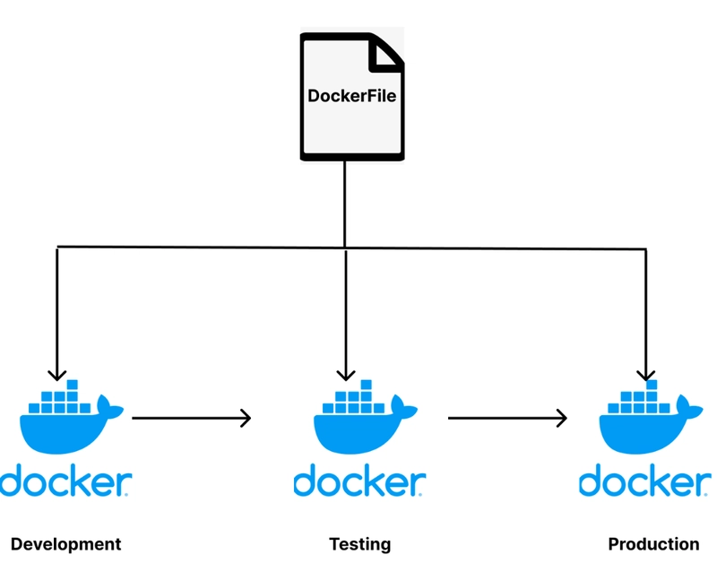
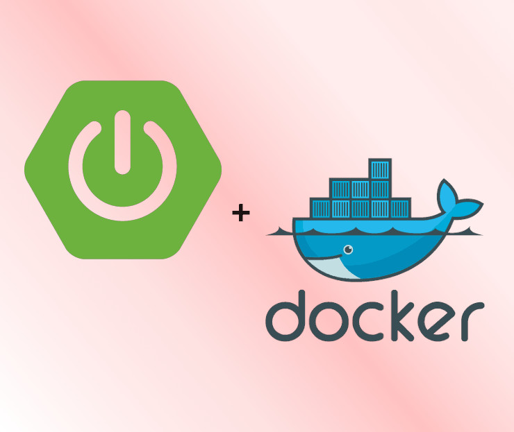
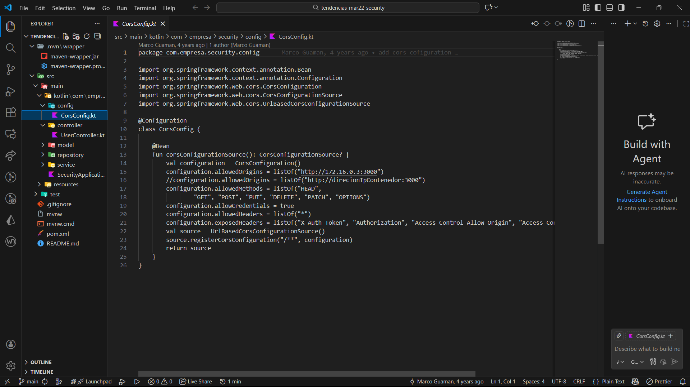
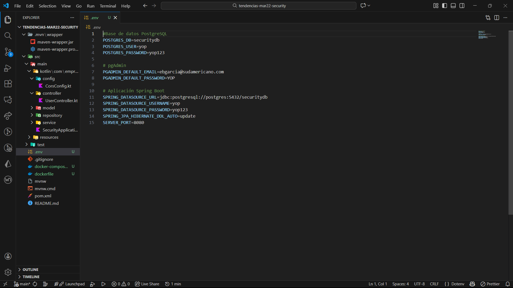
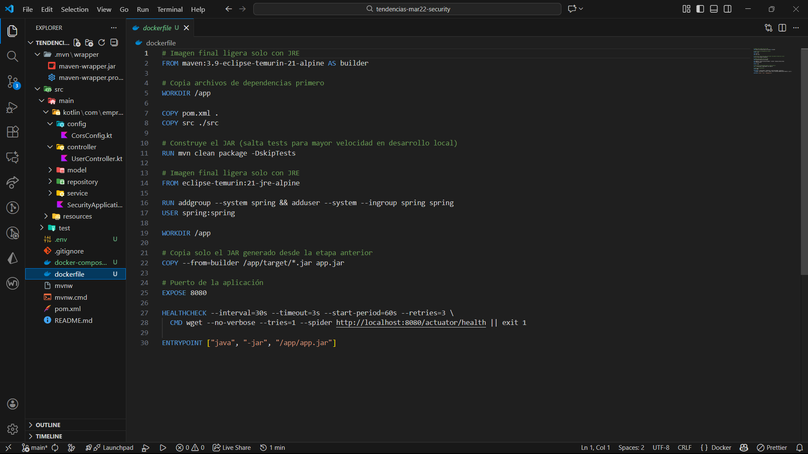
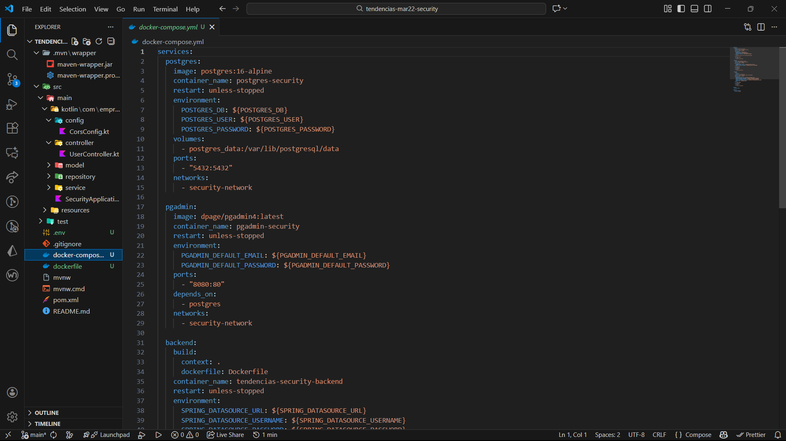
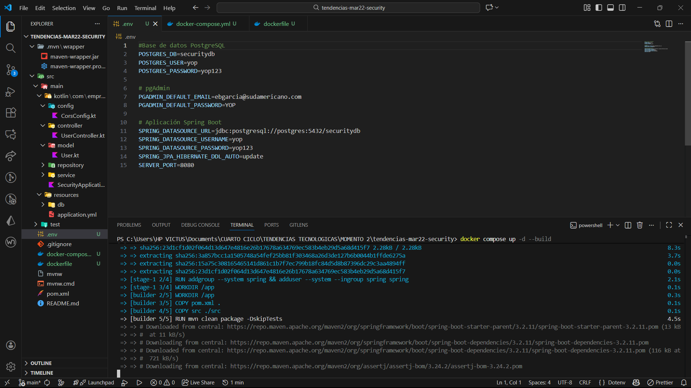
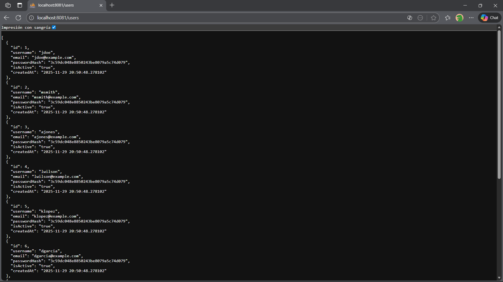
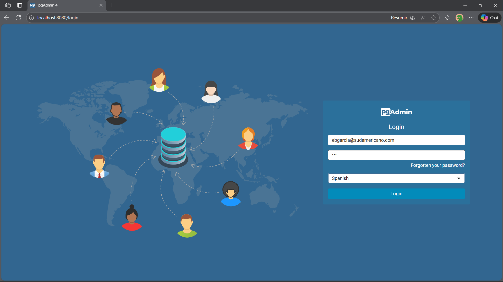
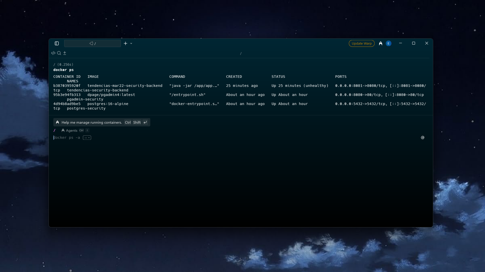

# **Contenerización de una Aplicación Spring Boot con PostgreSQL y pgAdmin usando Docker y Docker Compose**

## **1. Título**

**Automatización completa del despliegue de una aplicación backend Spring Boot con base de datos PostgreSQL y panel de administración pgAdmin mediante Docker y Docker Compose (multi-stage build)**

## **2. Tiempo de duración**

**Tiempo estimado:** 2 horas (120 minutos)  

## **3. Fundamentos**

### **Spring Boot**

Spring Boot es el framework más utilizado en Java para crear aplicaciones backend robustas, seguras y listas para producción. En este proyecto se implementa autenticación JWT, roles de usuario y conexión a base de datos relacional.

### **PostgreSQL**

PostgreSQL es uno de los motores de bases de datos relacionales más potentes y confiables del mundo. pgAdmin es su interfaz gráfica oficial que permite administrar bases de datos de forma visual.

### **¿Qué es Multi-Stage Builds en Docker?**

Los multi-stage builds son una técnica para construir imágenes Docker más pequeñas, rápidas y seguras, separando el proceso en múltiples etapas.
Cada etapa usa su propia imagen base y solo pasa al resultado final lo estrictamente necesario (el binario, archivos compilados, etc.).

Antes de multi-stage, era común construir una app dentro de una imagen gigante (con compiladores, librerías dev, herramientas) y esa misma imagen se convertía en la final haciendo imágenes pesadas y con basura.

### **Dockerfile y Multi-Stage Build**

El uso de **multi-stage builds** permite separar la fase de compilación (con Maven + JDK) de la fase de ejecución (solo JRE), logrando imágenes finales extremadamente ligeras, seguras y rápidas de desplegar.

<div style="display: flex; justify-content: space-between;">
  
  
</div>

## **4. Conocimientos previos**

Para realizar esta práctica, el estudiante debe tener claros los siguientes temas:

- Comandos básicos de Docker y Docker Compose
- Conceptos de contenedores, imágenes, volúmenes y redes
- Fundamentos de Spring Boot y JPA/Hibernate
- Uso básico de Maven
- Multi-Stage Builds en Docker
- Conocimiento básico de PostgreSQL

## **5. Objetivos a alcanzar**

- Clonar y desplegar automáticamente una aplicación Spring Boot completa
- Crear servicios de PostgreSQL y pgAdmin con persistencia de datos
- Implementar un Dockerfile con **multi-stage build** para optimizar el tamaño de la imagen
- Automatizar todo el entorno con un solo archivo `docker-compose.yml`
- Gestionar credenciales de forma segura mediante archivo `.env`
- Verificar conectividad, carga de datos iniciales y funcionamiento completo del backend

## **6. Equipo necesario**

- Computador con Windows, Linux o macOS
- Docker Desktop instalado (versión 24.x o superior)
- Terminal o línea de comandos
- Navegador web
- Conexión a internet

## **7. Material de apoyo**

- Documentación oficial de Docker
- Docker Compose
- Multi-stage builds
- Spring Boot + PostgreSQL
- Repositorio base

## **8. Procedimiento**

### **Paso 1: Clonar el repositorio del proyecto**

```bash
git clone https://github.com/maguaman2/tendencias-mar22-security.git
cd tendencias-mar22-security
```
<p align="center">  </p>

### Paso 2: Crear los archivos de configuración (en la raíz del proyecto)
Se crearon los siguientes archivos:

**1. .env**
```bash
#Base de datos PostgreSQL
POSTGRES_DB=securitydb
POSTGRES_USER=yop
POSTGRES_PASSWORD=yop123

# pgAdmin
PGADMIN_DEFAULT_EMAIL=ebgarcia@sudamericano.com
PGADMIN_DEFAULT_PASSWORD=YOP

# Aplicación Spring Boot
SPRING_DATASOURCE_URL=jdbc:postgresql://postgres:5432/securitydb
SPRING_DATASOURCE_USERNAME=yop
SPRING_DATASOURCE_PASSWORD=yop123
SPRING_JPA_HIBERNATE_DDL_AUTO=update
SERVER_PORT=8080
```
<p align="center">  </p>

**2. Dockerfile (multi-stage optimizado)**

```bash
# Imagen final ligera solo con JRE 
FROM maven:3.9-eclipse-temurin-21-alpine AS builder

# Copia archivos de dependencias primero 
WORKDIR /app

COPY pom.xml .
COPY src ./src

# Construye el JAR (salta tests para mayor velocidad en desarrollo local)
RUN mvn clean package -DskipTests

# Imagen final ligera solo con JRE 
FROM eclipse-temurin:21-jre-alpine

RUN addgroup --system spring && adduser --system --ingroup spring spring
USER spring:spring

WORKDIR /app

# Copia solo el JAR generado desde la etapa anterior
COPY --from=builder /app/target/*.jar app.jar

# Puerto de la aplicación
EXPOSE 8080

HEALTHCHECK --interval=30s --timeout=3s --start-period=60s --retries=3 \
  CMD wget --no-verbose --tries=1 --spider http://localhost:8081/users || exit 1

ENTRYPOINT ["java", "-jar", "/app/app.jar"]
```
<p align="center">  </p>

**3. docker-compose.yml**
``` bash 
services:
  postgres:
    image: postgres:16-alpine
    container_name: postgres-security
    restart: unless-stopped
    environment:
      POSTGRES_DB: ${POSTGRES_DB}
      POSTGRES_USER: ${POSTGRES_USER}
      POSTGRES_PASSWORD: ${POSTGRES_PASSWORD}
    volumes:
      - postgres_data:/var/lib/postgresql/data
    ports:
      - "5432:5432"
    networks:
      - security-network

  pgadmin:
    image: dpage/pgadmin4:latest
    container_name: pgadmin-security
    restart: unless-stopped
    environment:
      PGADMIN_DEFAULT_EMAIL: ${PGADMIN_DEFAULT_EMAIL}
      PGADMIN_DEFAULT_PASSWORD: ${PGADMIN_DEFAULT_PASSWORD}
    ports:
      - "8080:80"
    depends_on:
      - postgres
    networks:
      - security-network

  backend:
    build:
      context: .
      dockerfile: Dockerfile
    container_name: tendencias-security-backend
    restart: unless-stopped
    environment:
      SPRING_DATASOURCE_URL: ${SPRING_DATASOURCE_URL}
      SPRING_DATASOURCE_USERNAME: ${SPRING_DATASOURCE_USERNAME}
      SPRING_DATASOURCE_PASSWORD: ${SPRING_DATASOURCE_PASSWORD}
      SPRING_JPA_HIBERNATE_DDL_AUTO: ${SPRING_JPA_HIBERNATE_DDL_AUTO}
      SERVER_PORT: ${SERVER_PORT}
    ports:
      - "8081:8080"
    depends_on:
      - postgres
    networks:
      - security-network

volumes:
  postgres_data:

networks:
  security-network:
    driver: bridge
```
<p align="center">  </p>

### Paso 3: Levantar todo el entorno con un solo comando
```bash
docker compose up -d --build
```
Este comando:

- Construye la imagen optimizada del backend (multi-stage)
- Levanta PostgreSQL con volumen persistente
- Levanta pgAdmin
- Conecta automáticamente la app a la base de datos
- Carga los 10 usuarios de prueba desde data.sql
<p align="center">  </p>

### Paso 4: Verificar funcionamiento
Endpoint público con datos reales
```bash
http://localhost:8081/users
```
→ Devuelve JSON con los 10 usuarios de prueba 
pgAdmin
```bash 
http://localhost:8080
```
Login: ebgarcia@sudamericano.com  
Password: YOP

→ Conexión exitosa al servidor PostgreSQL 
<div style="display: flex; justify-content: space-between;">
  
  
</div>

## **9. Resultados esperados**
Al finalizar la práctica, el estudiante obtiene:

- Base de datos PostgreSQL persistente 
- Panel de administración pgAdmin totalmente operativo
- Aplicación Spring Boot con autenticación JWT funcionando
- Imagen Docker optimizada 
- Todo automatizado con un solo comando: docker compose up -d --build

<p align="center">  </p>

## **10. Bibliografía**

- Docker (2025). Multi-stage builds. https://docs.docker.com/build/building/multi-stage/
- Spring Boot Guide. https://spring.io/guides/gs/accessing-data-jpa/
- Docker Compose documentation. https://docs.docker.com/compose/
- pgAdmin 4 documentation. https://www.pgadmin.org/docs/
- Comandos para despliegue backend: https://wobbly-zephyr-621.notion.site/Semana-8-Despliegue-proyecto-backend-1f7a42399a818028b39ef841339a573f?pvs=143